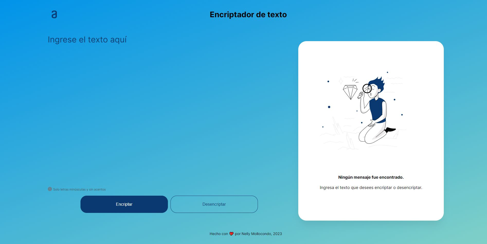

# Challenge ONE | Lógica de Programación - Encriptador de texto

     

Encriptador de texto, es un proyecto del primer challenge del programa de Oracle ONE. 

Se usa HTML5, CSS3 y JavaScript.

---

Es una aplicación que encripta textos, así podrás intercambiar mensajes secretos con otras personas que sepan el secreto de la encriptación utilizada.

Las "llaves" de encriptación son las siguientes:

- La letra "e" es convertida para "enter"
- La letra "i" es convertida para "imes"
- La letra "a" es convertida para "ai"
- La letra "o" es convertida para "ober"
- La letra "u" es convertida para "ufat"

Requisitos:

- Debe funcionar solo con letras minúsculas.
- No deben ser utilizados letras con acentos ni caracteres especiales.
- Debe ser posible convertir una palabra para la versión encriptada también devolver una palabra encriptada para su versión original.

Extras:

Un botón que copie el texto encriptado/desencriptado para la sección de transferencia, o sea que tenga la misma funcionalidad del ctrl+C o de la opción "copiar" del menú de las aplicaciones.

---

#### Visita la página del Desafío [¡Haciendo clic aquí!](https://nellymollocondo.github.io/Encriptador-de-texto--Challenge1-ONE/) 📃
